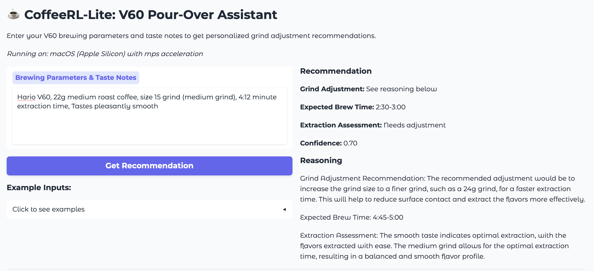

# CoffeeRL-Lite

A lightweight reinforcement learning framework for coffee optimization using transformer models and PEFT (Parameter-Efficient Fine-Tuning). Currently only fine tuning is implemented - RL is TODO

## Interface Preview



*Preview of the Gradio web interface for fine-tuning coffee parameters. Yes, It's truly terrible, 0.5B Qwen2 base fine-tuned on fully synthetic data generated using openai api*


## Project Structure

```
CoffeRL/
├── data/           # Datasets and data processing scripts
├── models/         # Saved model checkpoints and configurations
├── src/            # Source code for the CoffeeRL-Lite implementation
├── notebooks/      # Jupyter notebooks for exploration and analysis
├── config/         # Configuration files for training and deployment
├── scripts/        # Utility scripts and automation
├── tests/          # Test suite
├── .venv/          # Virtual environment (managed by UV)
├── pyproject.toml  # Project configuration and dependencies
├── uv.lock         # Dependency lock file
├── Dockerfile      # Docker configuration for Linux deployment
├── docker-compose.yml # Docker Compose for easy deployment
└── README.md       # This file
```

## Platform Compatibility

### macOS (Current Development Platform)
- ✅ **Supported**: All core ML libraries (transformers, peft, datasets, accelerate, gradio, pandas, torch)
- ✅ **Apple Silicon**: Optimized for M1/M2/M3 chips with MPS acceleration
- ❌ **bitsandbytes**: Not supported on macOS - quantization features disabled
- 🔄 **Workaround**: Use Docker for Linux environment when quantization is needed

### Linux/Windows
- ✅ **Full Support**: All libraries including bitsandbytes for quantization
- ✅ **CUDA**: GPU acceleration supported
- ✅ **Quantization**: 4-bit and 8-bit model quantization available

## Setup

This project uses [UV](https://github.com/astral-sh/uv) for fast Python package management.

### Local Development (macOS/Linux/Windows)

```bash
# Clone the repository
git clone <repository-url>
cd CoffeRL

# Install dependencies with UV
uv sync

# Check platform compatibility
uv run python config/platform_config.py

# Run tests
uv run pytest

# Start development
uv run python main.py
```

### Docker Deployment (Full Linux Support)

For full feature support including bitsandbytes quantization:

```bash
# Development with hot reload
docker-compose --profile dev up

# Production deployment
docker-compose --profile prod up

# GPU-enabled deployment (requires nvidia-docker)
docker-compose --profile gpu up
```

## Dependencies

### Core ML Libraries
- **transformers**: Hugging Face transformers library
- **peft**: Parameter-Efficient Fine-Tuning
- **datasets**: Hugging Face datasets library
- **accelerate**: Distributed training support
- **torch**: PyTorch deep learning framework
- **gradio**: Web UI for model interaction
- **pandas**: Data manipulation

### Development Tools
- **pytest**: Testing framework
- **black**: Code formatting
- **flake8**: Linting
- **isort**: Import sorting
- **mypy**: Type checking
- **pre-commit**: Git hooks for code quality

### Platform-Specific
- **bitsandbytes**: Quantization support (Linux/Windows only)
  - Automatically handled by `config/platform_config.py`
  - Graceful fallback on unsupported platforms
  - Docker deployment available for full support

## Quantization Strategy

### macOS Development
- Quantization features are automatically disabled
- Models run in full precision (float32/bfloat16)
- Development and testing can proceed normally
- Use `config/platform_config.py` for platform-aware code

### Production Deployment
- Use Docker for Linux environment with full bitsandbytes support
- 4-bit and 8-bit quantization available
- GPU acceleration with CUDA
- Automatic platform detection and configuration

### Example Usage

```python
from config.platform_config import get_quantization_config, get_torch_dtype

# Get platform-appropriate quantization config
quant_config = get_quantization_config(use_4bit=True)

# Get optimal torch dtype for platform
torch_dtype = get_torch_dtype()

# Load model with platform-specific settings
model = AutoModelForCausalLM.from_pretrained(
    model_name,
    quantization_config=quant_config,  # None on macOS
    torch_dtype=torch_dtype,
    device_map="auto"
)
```

## Development Workflow

1. **Local Development**: Use macOS/local environment for development and testing
2. **Code Quality**: Pre-commit hooks ensure consistent code style
3. **Testing**: Comprehensive test suite with platform-aware tests
4. **Deployment**: Docker for production with full quantization support
5. **CI/CD**: Platform-specific testing and deployment pipelines

## Getting Started

1. Check platform compatibility: `uv run python config/platform_config.py`
2. Run the test suite: `uv run pytest`
3. Start the application: `uv run python main.py`
4. For quantization features: Use Docker deployment

## Notes

- **bitsandbytes compatibility**: Automatically handled - no manual intervention needed
- **Apple Silicon**: Optimized for M1/M2/M3 with MPS acceleration
- **Memory efficiency**: Platform-appropriate data types selected automatically
- **Cloud deployment**: Docker images work on any cloud provider with GPU support

## License

This project is licensed under the Apache 2.0 License - see the [LICENSE](LICENSE) document for details.
