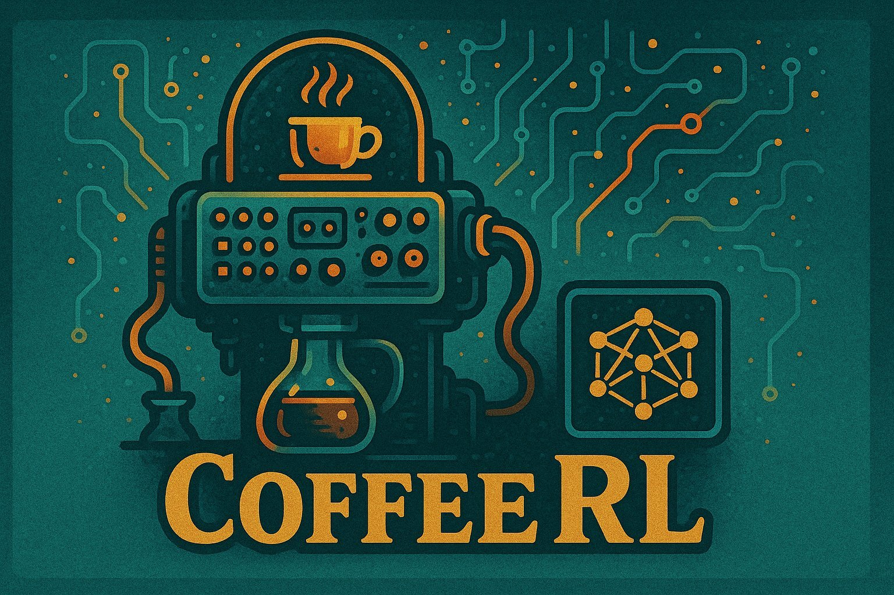
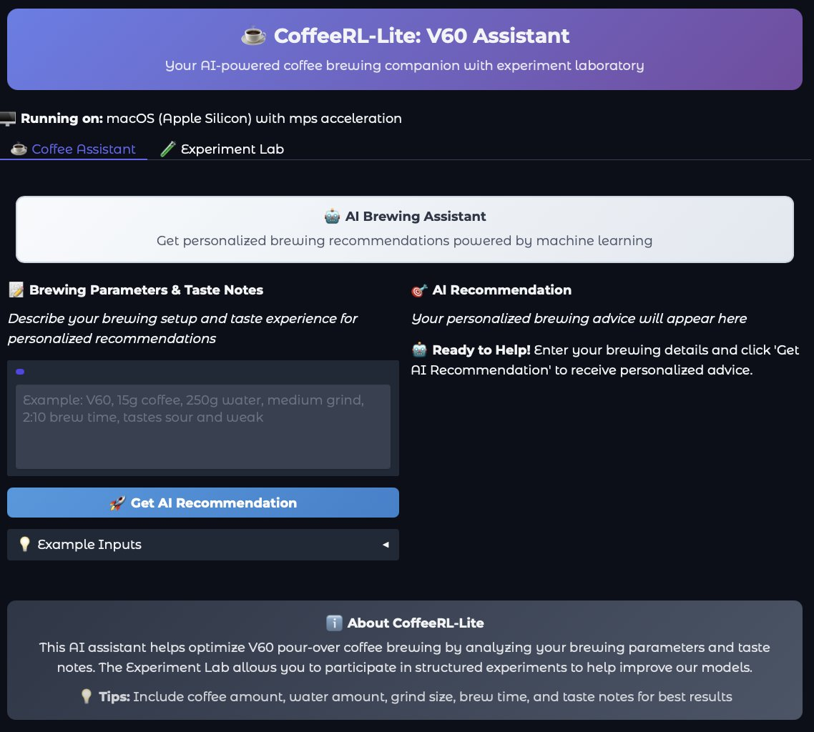
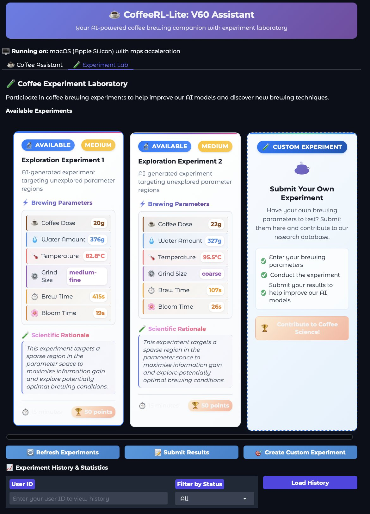

# CoffeeRL-Lite

A lightweight reinforcement learning framework for coffee optimization using transformer models and PEFT (Parameter-Efficient Fine-Tuning). Train AI models to optimize coffee brewing parameters through reinforcement learning and compare their performance.

## Interface Preview

 


*Preview of the Gradio web interface and Experiment Lab for fine-tuning coffee parameters*

## Key Features

- 🤖 **Reinforcement Learning**: PPO-based training with TRL library
- 📊 **Model Comparison**: Comprehensive performance comparison between models
- 🔄 **Batch Training**: Automated weekly batch training with data accumulation
- 🤗 **Hugging Face Integration**: Model versioning and sharing via HF Hub
- 📈 **Performance Tracking**: Detailed metrics and reward calculation
- 🧪 **Comprehensive Testing**: Full test suite with 100% coverage for core components

## Quick Start

### Installation

This project uses [UV](https://github.com/astral-sh/uv) for fast Python package management.

```bash
# Clone the repository
git clone <repository-url>
cd CoffeRL

# Install dependencies with UV
uv sync

# Check platform compatibility
uv run python config/platform_config.py

# Launch the application
uv run python main.py
```

### Using Docker

For full feature support including quantization:

```bash
# Quick start with Docker Compose
docker-compose --profile prod up

# With GPU support (requires nvidia-docker)
docker-compose --profile gpu up
```

## Usage

### Web Interface

Launch the Gradio web interface for interactive coffee optimization:

```bash
uv run python main.py
```

This provides:
- **Chatbot Interface**: Interactive coffee brewing assistant
- **Experiment Lab**: Fine-tune coffee parameters and compare results
- **Model Comparison**: Visual comparison between different model versions

### Command Line Tools

#### Model Comparison

Compare performance between different model versions:

```bash
# Quick comparison (10 samples for fast testing)
uv run python src/model_comparator.py \
  --model1 checkpoints/batch_training/batch_1 \
  --model2 checkpoints/batch_training/batch_2 \
  --max-samples 10

# Compare HuggingFace Hub models
uv run python src/model_comparator.py \
  --model1 batch-1 --model1-hf \
  --model2 batch-2 --model2-hf \
  --dataset data/processed/coffee_validation_dataset
```

#### Batch Training

Manage automated training workflows:

```bash
# Check training status
uv run python src/batch_trainer.py status

# Run batch training
uv run python src/batch_trainer.py train --episodes 500

# View training history
uv run python src/batch_trainer.py history
```

#### Reinforcement Learning Training

Train models with custom parameters:

```bash
# Train with default settings
uv run python src/train_rl.py --episodes 100

# Train with custom dataset
uv run python src/train_rl.py \
  --dataset data/processed/coffee_training_dataset \
  --episodes 200 \
  --save-freq 50
```

## Platform Compatibility

### macOS (Apple Silicon Optimized)
- ✅ **Supported**: All core ML libraries with MPS acceleration
- ✅ **Apple Silicon**: Optimized for M1/M2/M3 chips
- ❌ **Quantization**: Limited support (use Docker for full features)

### Linux/Windows
- ✅ **Full Support**: All libraries including quantization
- ✅ **CUDA**: GPU acceleration supported
- ✅ **Quantization**: 4-bit and 8-bit model quantization available

## Documentation

- **[Contributing Guide](docs/CONTRIBUTING.md)** - Development setup and guidelines
- **[CLI Tools Reference](docs/CLI_TOOLS.md)** - Comprehensive CLI documentation
- **[Pipeline Documentation](docs/PIPELINE.md)** - Training and evaluation pipelines
- **[Deployment Guide](docs/DEPLOYMENT.md)** - Production deployment instructions
- **[QLoRA Setup](docs/QLORA_SETUP.md)** - Quantization and fine-tuning setup

## Examples

### Basic Model Training

```bash
# Start with a quick training run
uv run python src/train_rl.py --episodes 10

# Compare with baseline
uv run python src/model_comparator.py \
  --model1 checkpoints/batch_training/batch_1 \
  --model2 checkpoints/batch_training/batch_2 \
  --max-samples 10
```

### Web Interface Usage

1. Launch the application: `uv run python main.py`
2. Open your browser to the displayed URL
3. Use the **Chatbot** tab for interactive coffee advice
4. Use the **Experiment Lab** tab to fine-tune brewing parameters
5. Compare different models and their recommendations

## Contributing

We welcome contributions! Please see our [Contributing Guide](docs/CONTRIBUTING.md) for:

- Development setup instructions
- Code style guidelines
- Testing requirements
- Pull request process

## Support

- **Issues**: Report bugs and request features via GitHub Issues
- **Documentation**: Check the `docs/` directory for detailed guides
- **Platform Issues**: Use Docker for full feature compatibility

## License

This project is licensed under the Apache 2.0 License - see the [LICENSE](LICENSE) document for details.
