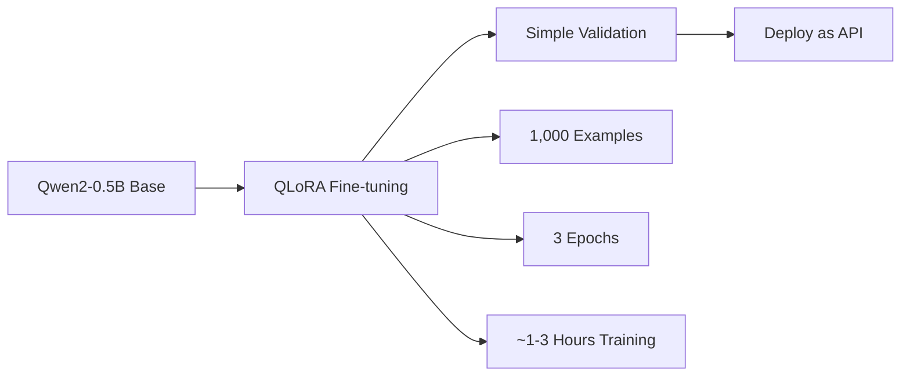

# CoffeeRL-Lite: A Practical Coffee Reasoning Model for Solo Developers
## Product Requirements Document v2.0 (Ultra-Low Budget Edition)

---

## Executive Summary

CoffeeRL-Lite is a focused, practical implementation of a coffee brewing AI assistant, designed to be built by a single developer on an ultra-low budget (<$150). Using Qwen2-0.5B (for local development) with QLoRA fine-tuning, the project focuses exclusively on V60 pour-over optimization with 1,000 high-quality training examples.

---

## 1. Project Overview

### 1.1 Revised Vision
Create a minimal viable coffee model that can:
- Optimize grind size for V60 brewing
- Predict extraction issues from brewing parameters
- Suggest simple adjustments for better coffee
- Demonstrate feasibility for future expansion

### 1.2 Key Constraints
- **Budget**: <$150 total (local development)
- **Timeline**: 6 weeks part-time
- **Scope**: V60 pour-over only
- **Developer**: Single person, 20 hours/week

---

## 2. Technical Architecture (Simplified)

### 2.1 Model Foundation
- **Base Model**: Qwen2-0.5B (for local development) / Qwen2-1.5B (for production)
- **Why**: Excellent reasoning capability, multilingual support, optimized for efficiency
- **Training**: QLoRA (4-bit quantization)
- **Hardware**: Local development (CPU/MPS) + Google Colab Pro (T4 GPU) for larger models

### 2.2 Simplified Training Pipeline



### 2.3 Core Components (Minimal)

```python
# Simplified reward structure
rewards = {
    "grind_adjustment": binary_correct_direction,
    "brew_time_prediction": within_15_seconds,
    "extraction_category": correct_category  # under/good/over
}

# Output format (simple JSON)
{
    "grind_change": "finer_2_clicks",
    "expected_time": "2:45",
    "extraction": "under",
    "confidence": 0.85
}
```

---

## 3. Data Requirements (Realistic)

### 3.1 Data Sources (1,000 Total Examples)

#### Phase 1: Initial Dataset (Week 1-2)
1. **Manual Creation** (200 examples)
   - Personal brewing logs
   - Coffee forum extractions
   - YouTube barista videos transcripts

2. **GPT-3.5 Generation** (600 examples)
   - Cost: ~$15-20
   - Template-based generation
   - Validated against coffee principles

3. **Community Contribution** (200 examples)
   - r/coffee community dataset
   - Local coffee shop partnerships
   - Coffee Discord/Slack groups

### 3.2 Focused Question Types

```json
{
  "training_examples": [
    {
      "input": "V60, 15g coffee, 250g water, 2:00 brew time, tastes sour",
      "output": {
        "grind_change": "finer_2_clicks",
        "reasoning": "Fast brew time + sour = under-extraction"
      }
    },
    {
      "input": "V60, 20g coffee, 320g water, 3:30 brew time, bitter finish",
      "output": {
        "grind_change": "coarser_3_clicks",
        "reasoning": "Slow brew time + bitter = over-extraction"
      }
    }
  ]
}
```

### 3.3 Data Generation Script

```python
# Generate training data with GPT-3.5
def generate_coffee_qa(n_examples=600):
    template = """Generate a V60 brewing problem and solution:
    Problem: [brewing parameters and taste issue]
    Solution: [grind adjustment and reasoning]
    Format as JSON."""

    # Cost: ~$0.002 per example = $1.20 per 600
    examples = []
    for _ in range(n_examples):
        response = gpt35_complete(template)
        examples.append(parse_response(response))
    return examples
```

---

## 4. Technical Stack (Minimal)

### 4.1 Development Environment
```yaml
compute:
  local: "CPU/MPS for Qwen2-0.5B development"
  cloud: "Google Colab Pro for larger models"
  cost: "$12/month (optional for larger models)"
  gpu: "T4 (16GB) or local MPS/CUDA"

training:
  library: "peft + transformers"
  method: "QLoRA 4-bit (cloud) / Full precision (local)"
  time: "~1-3 hours total"

deployment:
  option1: "Hugging Face Spaces (free)"
  option2: "Gradio app (local)"
  option3: "Simple Flask API"
```

### 4.2 Complete Tech Stack
```python
# requirements.txt (minimal)
transformers>=4.40.0
peft>=0.10.0
bitsandbytes>=0.43.0
datasets>=2.14.0
accelerate>=0.28.0
gradio>=4.8.0
pandas>=2.0.0
torch>=2.0.0
```

### 4.3 Training Configuration
```python
# QLoRA configuration for Qwen2
config = LoraConfig(
    r=16,  # Low rank
    lora_alpha=32,
    target_modules=["q_proj", "k_proj", "v_proj", "o_proj", "gate_proj", "up_proj", "down_proj"],
    lora_dropout=0.1,
    bias="none",
    task_type="CAUSAL_LM"
)

# Training args optimized for local development and T4
training_args = TrainingArguments(
    per_device_train_batch_size=8,  # Higher for 0.5B model
    gradient_accumulation_steps=2,
    num_train_epochs=3,
    learning_rate=2e-4,
    fp16=True,  # Use bf16 for better stability with Qwen2
    save_strategy="epoch",
    logging_steps=10,
    output_dir="./coffee-qwen2-qlora"
)
```

---

## 5. Minimum Viable Training Process

### 5.1 Week-by-Week Plan

**Week 1: Data Collection**
- Set up data collection templates
- Create 50 manual examples
- Generate 200 GPT-3.5 examples
- Validate data quality

**Week 2: Data Completion**
- Collect remaining examples
- Create validation set (100 examples)
- Format data for training
- Set up evaluation metrics

**Week 3: Initial Training**
- Set up Colab environment
- Configure QLoRA for Phi-2
- Run first training (3 hours)
- Evaluate on validation set

**Week 4: Iteration**
- Analyze failure cases
- Improve data quality
- Retrain with improvements
- Test with real brewing

**Week 5: Deployment**
- Create simple Gradio interface
- Deploy to Hugging Face Spaces
- Create API endpoint
- Write documentation

**Week 6: Community Release**
- Open source the model
- Create GitHub repository
- Write blog post
- Gather feedback

---

## 6. Evaluation Framework (Simplified)

### 6.1 Success Metrics
```python
metrics = {
    "grind_direction_accuracy": 0.80,  # 80% correct direction
    "brew_time_mae": 15,  # ±15 seconds
    "user_satisfaction": 0.75,  # 75% helpful ratings
}
```

### 6.2 Simple Test Set
- 100 held-out examples
- 20 real-world brewing tests
- 5 coffee shop validations

### 6.3 A/B Testing Plan
- Week 1-2: Baseline (use brewing charts)
- Week 3-4: Model predictions
- Compare extraction quality

---

## 7. Deployment Strategy

### 7.1 MVP Deployment Options

**Option 1: Hugging Face Spaces (Recommended)**
- Free hosting
- Gradio interface
- Easy sharing
```python
# app.py for HF Spaces
import gradio as gr
from transformers import AutoModelForCausalLM, AutoTokenizer

def predict_coffee(params):
    # Model inference
    return grind_suggestion, reasoning

iface = gr.Interface(
    fn=predict_coffee,
    inputs=["text"],
    outputs=["text", "text"],
    title="CoffeeRL-Lite V60 Assistant"
)
```

**Option 2: Discord Bot**
- Community engagement
- Real-time feedback
- Cost: Free (self-hosted)

**Option 3: Simple Web API**
- Flask on free tier
- Basic REST endpoint
- Heroku or Render.com

### 7.2 Model Distribution
```yaml
artifacts:
  model_weights: "HuggingFace Hub"
  dataset: "HuggingFace Datasets"
  training_code: "GitHub"
  license: "Apache 2.0"
```

---

## 8. Budget Breakdown (Ultra-Low)

### 8.1 Detailed Costs
| Item | Cost | Notes |
|------|------|-------|
| Colab Pro (optional) | $12 | 1 month for larger models |
| Data Generation | $20 | GPT-3.5 API |
| TDS Meter | $30 | Used/basic model |
| Coffee Beans | $50 | Testing varieties |
| Domain (optional) | $12 | One year |
| **Total** | **$124** | Under $125 (local development) |

### 8.2 Optional Upgrades
- Better TDS meter: +$100
- RunPod credits: +$50
- Coffee equipment: +$100

---

## 9. Risk Mitigation (Revised)

### 9.1 Technical Risks
- **Model Too Small**: Start with basic tasks, expand gradually
- **Poor Data Quality**: Manual validation of each example
- **Training Instability**: Use proven QLoRA settings

### 9.2 Mitigation Strategies
- Keep backup of working checkpoints
- Test incrementally
- Engage coffee community early

---

## 10. Success Criteria (Realistic)

### 10.1 Minimum Success
- 70% accuracy on grind direction
- 50+ community users
- Positive feedback from 3 coffee shops

### 10.2 Stretch Goals
- Expand to espresso
- 90% accuracy
- 500+ users

---

## 11. Implementation Code Examples

### 11.1 Data Generation Template
```python
PROMPT_TEMPLATE = """
You are a coffee expert. Generate a realistic V60 brewing scenario.

Example format:
Input: "V60, 15g coffee, 250g water, medium grind, 2:30 total time, tastes balanced"
Output: {"assessment": "good extraction", "suggestion": "maintain current grind"}

Now generate a new scenario with an issue:
"""

def create_dataset():
    data = []
    # Manual examples
    data.extend(load_manual_examples())

    # GPT-3.5 generation
    for _ in range(600):
        example = generate_with_gpt35(PROMPT_TEMPLATE)
        if validate_example(example):
            data.append(example)

    return Dataset.from_pandas(pd.DataFrame(data))
```

### 11.2 Training Script (Colab-Ready)
```python
# train_coffee_model.py
from transformers import AutoModelForCausalLM, AutoTokenizer, TrainingArguments
from peft import LoraConfig, get_peft_model, prepare_model_for_kbit_training
from trl import SFTTrainer

# Load model in 4-bit (or full precision for local 0.5B)
model = AutoModelForCausalLM.from_pretrained(
    "Qwen/Qwen2-0.5B-Instruct",  # or Qwen2-1.5B-Instruct for production
    load_in_4bit=True,  # Set to False for local development
    device_map="auto",
    trust_remote_code=True
)

# Prepare for QLoRA
model = prepare_model_for_kbit_training(model)
model = get_peft_model(model, lora_config)

# Train
trainer = SFTTrainer(
    model=model,
    train_dataset=coffee_dataset,
    max_seq_length=512,
    args=training_args
)

trainer.train()
```

### 11.3 Simple Inference
```python
def coffee_assistant(brewing_params):
    prompt = f"Analyze this V60 brew: {brewing_params}\n\nSolution:"

    inputs = tokenizer(prompt, return_tensors="pt")
    outputs = model.generate(**inputs, max_length=150)

    response = tokenizer.decode(outputs[0], skip_special_tokens=True)
    return parse_coffee_advice(response)
```

---

## 12. Community Engagement Plan

### 12.1 Launch Strategy
1. **Soft Launch**: r/coffee and r/espresso
2. **Coffee Forums**: Home-Barista, CoffeeGeek
3. **Local Testing**: 3-5 coffee shops
4. **YouTube Demo**: Simple brewing comparison

### 12.2 Feedback Collection
- Google Form for brew results
- Discord server for discussions
- GitHub issues for improvements

---

## 13. Future Expansion Path

Once MVP succeeds:
1. **Month 2**: Add espresso support (+500 examples)
2. **Month 3**: Water chemistry module
3. **Month 4**: Multi-language support
4. **Month 6**: Mobile app with camera grind analysis

---

## Appendix A: Quick Start Guide

```bash
# 1. Clone repo
git clone https://github.com/yourusername/coffee-rl-lite

# 2. Install dependencies
pip install -r requirements.txt

# 3. Download model
python download_model.py

# 4. Run web interface
python app.py

# 5. Visit http://localhost:7860
```

## Appendix B: Example Interaction

```
User: My V60 is taking 2:00 to brew with 15g coffee and 250g water.
      It tastes sour and lacks sweetness.

CoffeeRL-Lite: Based on your fast brew time (2:00) and sour taste,
you're experiencing under-extraction.

Recommendation: Grind 2-3 clicks finer
Expected result: Brew time should increase to 2:30-2:45
This will improve extraction and bring out more sweetness.

Confidence: 85%
```

## Appendix C: Ethical Considerations

- No health claims about caffeine
- Encourage responsible consumption
- Open source for transparency
- Privacy: No user data storage
